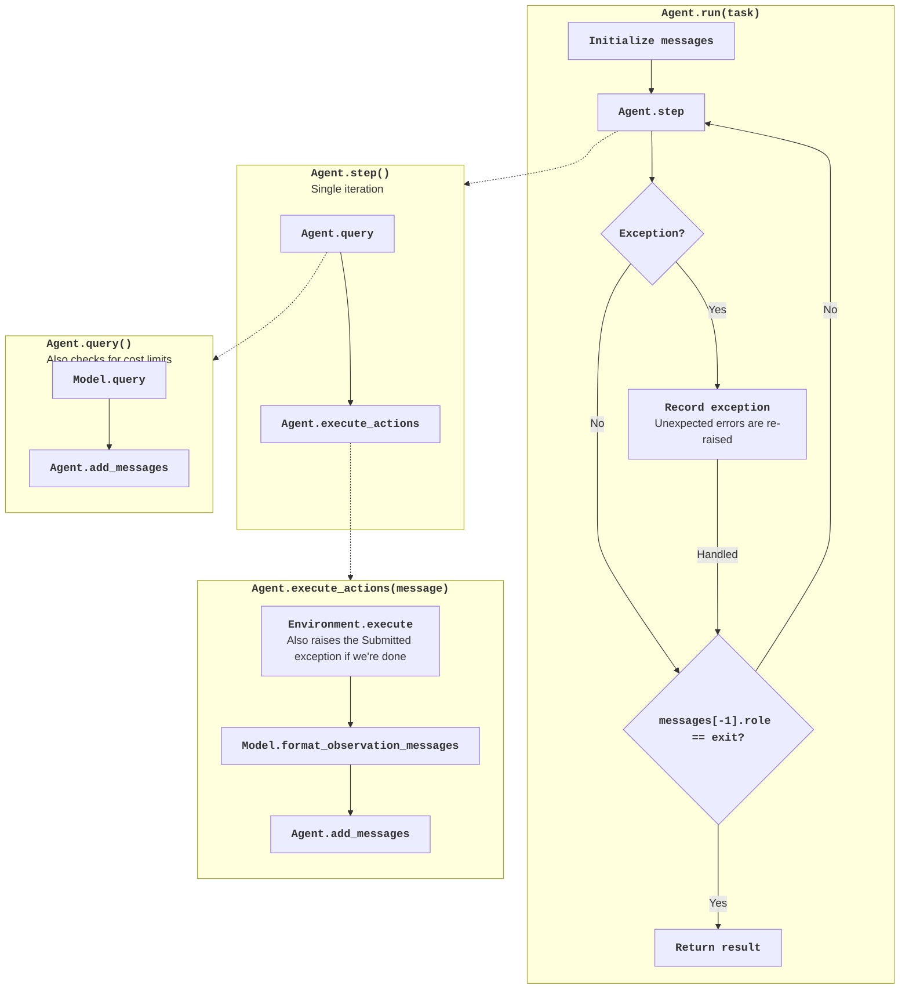

# Agent control flow

!!! note "Understanding AI agent basics"

    For an introduction to agent design, see [this tutorial](https://minimal-agent.com).

!!! abstract "Understanding the default agent"

    * This guide shows the control flow of the default agent.
    * See the [cookbook](cookbook.md) to extend the agent.

The following diagram shows the control flow of the agent:



The implementation is embedded below so the guide follows the current code:

??? note "Default agent class"

    - [Read on GitHub](https://github.com/zeyu-zheng/Leanimum-agent/blob/main/src/leanimum/agents/default.py)
    - [API reference](../reference/agents/default.md)

    ```python
    --8<-- "src/leanimum/agents/default.py"
    ```

`DefaultAgent.run` renders the task and repeatedly calls `step`, which queries the
model, executes its actions and appends observations. Model implementations format
those observations for their own API.

- `Submitted` finishes the task after a zero-exit command emits the completion marker.
- `LimitsExceeded` and `TimeExceeded` stop work at configured budgets.
- `FormatError` adds corrective feedback; repeated format errors can end the run.
- `UserInterruption` lets the interactive agent add feedback or change modes.
- Command timeouts are returned as environment observations. They are not an
  agent `TimeoutError` exception.

Unexpected exceptions are recorded and re-raised. The `finally` path saves the
trajectory, and an exit message supplies the returned submission/status.

See [Python bindings](../usage/python_bindings.md) for construction and
[the cookbook](cookbook.md) for subclassing.


